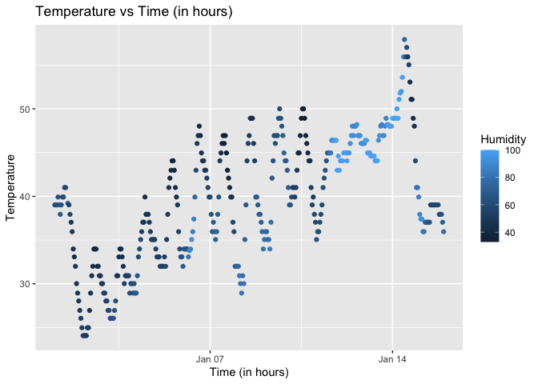

p8105_hw1_lg3450
================
Luyun Ge
2025-09-20

R Markdown file by Luyun Ge for P8105 Homework1.

We start by loading required libraries.

``` r
library(moderndive)
library(ggplot2)
library(tidyverse)
```

    ## ── Attaching core tidyverse packages ──────────────────────── tidyverse 2.0.0 ──
    ## ✔ dplyr     1.1.4     ✔ readr     2.1.5
    ## ✔ forcats   1.0.0     ✔ stringr   1.5.1
    ## ✔ lubridate 1.9.4     ✔ tibble    3.3.0
    ## ✔ purrr     1.1.0     ✔ tidyr     1.3.1
    ## ── Conflicts ────────────────────────────────────────── tidyverse_conflicts() ──
    ## ✖ dplyr::filter() masks stats::filter()
    ## ✖ dplyr::lag()    masks stats::lag()
    ## ℹ Use the conflicted package (<http://conflicted.r-lib.org/>) to force all conflicts to become errors

# Problem1

We load the required dataset for problem1.

``` r
data("early_january_weather")
```

Then we list all variables in this dataset, calculate the size of this
dataset and the mean temperature.

``` r
names(early_january_weather) #listed all variables in dataset
```

    ##  [1] "origin"     "year"       "month"      "day"        "hour"      
    ##  [6] "temp"       "dewp"       "humid"      "wind_dir"   "wind_speed"
    ## [11] "wind_gust"  "precip"     "pressure"   "visib"      "time_hour"

``` r
nrow(early_january_weather) #number of rows
```

    ## [1] 358

``` r
ncol(early_january_weather) #number of columns
```

    ## [1] 15

``` r
mean(early_january_weather$temp) #mean temperature
```

    ## [1] 39.58212

The `early_january_weather dataset` has 15 variables: `origin`, `year`,
`month`, `day`, `hour`, `temp`, `dewp`, `humid`, `wind_dir`,
`wind_speed`, `wind_gust`, `precip`, `pressure`, `visib`, `time_hour`.
The dataset has 358 rows and 15 columns. The mean temperarture of early
January is 39.58212 Fahrenheit.

Then we plot the scatterplot of temperature vs time.

``` r
p1_plot <- ggplot(early_january_weather, aes(x = time_hour, y = temp, color = humid)) +
  geom_point() +
  labs(title = "Temperature vs Time (in hours)",
       x = "Time (in hours)",
       y = "Temperature",
       color = "Humidity")
p1_plot
```

<!-- -->

``` r
ggsave("temp_vs_time_hour.png", plot = p1_plot)
```

    ## Saving 7 x 5 in image

The scatterplot shows that temperature fluctuates across the hours of
the day over early January, generally ranging from about 25 to 50
degrees Fahrenheit.Higher humidity values (lighter blue points) occur
more often at higher temperatures, while lower humidity values (darker
blue points) occur at lower temperatures, indicating a positive
relationship between temperature and humidity over time.

# Problem2

To solve the problem, we first create the data frame based on
requirements.

``` r
p2_df <- data.frame(
  random_Nsample = rnorm(10),
  greater_than_zero = rnorm(10) > 0,
  character = letters[1:10],
  factor = factor(rep(c("A", "B", "C"), length.out = 10))
)
p2_df
```

    ##    random_Nsample greater_than_zero character factor
    ## 1       2.4199558             FALSE         a      A
    ## 2       0.4811563             FALSE         b      B
    ## 3       0.2787637             FALSE         c      C
    ## 4       0.7785811              TRUE         d      A
    ## 5      -0.7302775              TRUE         e      B
    ## 6       0.1563277              TRUE         f      C
    ## 7      -0.2211999             FALSE         g      A
    ## 8       0.5734858             FALSE         h      B
    ## 9       1.0120030             FALSE         i      C
    ## 10      1.9394425             FALSE         j      A

Then calculate the mean of each variables in the data frame.

``` r
mean(pull(p2_df,random_Nsample))
```

    ## [1] 0.6688239

``` r
mean(pull(p2_df,greater_than_zero))
```

    ## [1] 0.3

``` r
mean(pull(p2_df,character))
```

    ## Warning in mean.default(pull(p2_df, character)): argument is not numeric or
    ## logical: returning NA

    ## [1] NA

``` r
mean(pull(p2_df,factor))  
```

    ## Warning in mean.default(pull(p2_df, factor)): argument is not numeric or
    ## logical: returning NA

    ## [1] NA

The mean could be calculated for `random_Nsample` because the mean
function works for numeric values. The mean could also be calculated for
`greater_than_zero` because R converts TRUE to 1 and FALSE to 0. We
failed to calculate the mean for `character` and `factor` because
characters and categorical factors cannot be averaged. Now we convert
all variables to numeric variables.

``` r
as.numeric(p2_df$greater_than_zero)
```

    ##  [1] 0 0 0 1 1 1 0 0 0 0

``` r
as.numeric(p2_df$character)
```

    ## Warning: NAs introduced by coercion

    ##  [1] NA NA NA NA NA NA NA NA NA NA

``` r
as.numeric(p2_df$factor)
```

    ##  [1] 1 2 3 1 2 3 1 2 3 1

We are able to convert the `greater_than_zero` and `factor` variables to
numeric, but conversion fails for the `character` variable. The logical
variable `greater_than_zero` converts to 0 and 1, so calculating its
mean is meaningful. `factor` converts to underlying integer codes; while
the mean produces a number, it does not meaningfully represent the
categories.
